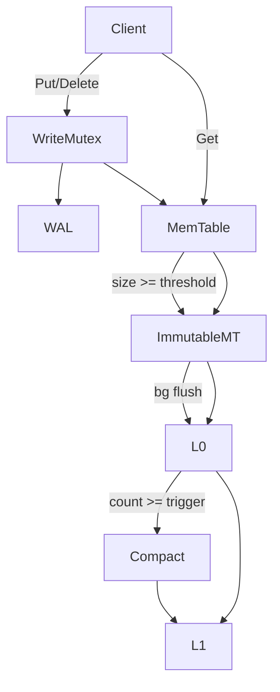

# lsm-kv Design Document

**Status:** Active  
**Date:** 2026-07-04  
**Language:** C++17  

## Overview

`lsm-kv` is an educational embedded key-value engine. It implements the classic LSM write path (WAL → MemTable → SSTable) and a minimal two-level read path with background compaction. The goal is a correct, multi-threaded, well-tested codebase that is easy to review in small PRs.

## Goals

- Correct `Put` / `Get` / `Delete` with durable WAL-backed writes
- Crash recovery via WAL replay + manifest
- Safe concurrent readers with serialized writers
- Background MemTable flush and L0→L1 compaction
- Exhaustive unit tests per component and multi-threaded integration tests
- Simple code: no compression, no lock-free algorithms, no fancy bloom filters in v1

## Non-Goals

- Performance parity with RocksDB/LevelDB
- Snapshots / transactions / iterators (v1 may add a basic iterator later)
- Compression, checksum streaming, or direct I/O
- Distributed replication

## Key Decisions

| Decision | Choice | Rationale |
|----------|--------|-----------|
| Memory index | Mutex-protected SkipList | Easy to understand; `shared_mutex` gives concurrent reads |
| Keys/values | `std::string` | Avoids custom allocators in an educational codebase |
| Internal key | `user_key | seq(desc) | type` | Newest version sorts first; tombstones are first-class |
| On-disk format | Restart-point blocks + index + footer | Mirrors LevelDB enough to transfer learning |
| Levels | L0 overlapping, L1 non-overlapping | Smallest useful compaction story |
| Concurrency | Write mutex + shared memtable lock + version mutex | Simple correctness model |
| Testing | Header-only harness (no gtest dep) | Matches `jsvm`; zero external deps |

## Data flow



## File layout in a DB directory

```
/path/to/db/
  CURRENT          # points at current MANIFEST file name
  MANIFEST-000001  # version edit log (live file set)
  000001.log       # WAL
  000002.sst       # SSTable
  000003.sst
  LOCK             # exclusive lock file
```

## PR Plan

### PR 1: CMake scaffold, CI, and test harness
- **Files/components affected:** `CMakeLists.txt`, `.github/workflows/ci.yml`, `tests/test_harness.hpp`, `tests/test_main.cpp`, `tests/test_smoke.cpp`, `src/placeholder.cpp`
- **Dependencies:** None
- **Description:** Empty library target, smoke test, GitHub Actions matrix (Debug/Release × gcc/clang).

### PR 2: Core types — Status, Slice, Options
- **Files/components affected:** `include/lsmkv/status.hpp`, `slice.hpp`, `options.hpp`, `coding.hpp`, `src/status.cpp`, `src/coding.cpp`, `tests/test_status.cpp`, `tests/test_slice.cpp`, `tests/test_coding.cpp`
- **Dependencies:** PR 1
- **Description:** Error type, non-owning byte view, varint/fixed encoders, DB options structs.

### PR 3: Concurrent SkipList
- **Files/components affected:** `include/lsmkv/skiplist.hpp`, `tests/test_skiplist.cpp`
- **Dependencies:** PR 2
- **Description:** Templated skip list with `shared_mutex`, insert/lookup/iterate, multi-threaded stress tests.

### PR 4: MemTable with sequence numbers and tombstones
- **Files/components affected:** `include/lsmkv/memtable.hpp`, `internal_key.hpp`, `src/memtable.cpp`, `src/internal_key.cpp`, `tests/test_memtable.cpp`, `tests/test_internal_key.cpp`
- **Dependencies:** PR 3
- **Description:** Wrap SkipList; encode internal keys; support Get with visibility by sequence.

### PR 5: Write-ahead log
- **Files/components affected:** `include/lsmkv/wal.hpp`, `src/wal.cpp`, `include/lsmkv/crc32.hpp`, `src/crc32.cpp`, `tests/test_wal.cpp`
- **Dependencies:** PR 2
- **Description:** Append records with CRC, sync option, reader for recovery, corruption detection.

### PR 6: Block and SSTable format
- **Files/components affected:** `include/lsmkv/block.hpp`, `sstable.hpp`, `src/block.cpp`, `src/sstable.cpp`, `tests/test_block.cpp`, `tests/test_sstable.cpp`
- **Dependencies:** PR 2, PR 4
- **Description:** Block builder/iterator with restart points; SSTable writer/reader with index block and footer.

### PR 7: Version set and manifest
- **Files/components affected:** `include/lsmkv/version.hpp`, `src/version.cpp`, `tests/test_version.cpp`
- **Dependencies:** PR 6
- **Description:** `FileMetaData`, `Version`, `VersionSet`, manifest encode/decode, `CURRENT` file handling.

### PR 8: DB engine — Put/Get/Delete, flush, recovery
- **Files/components affected:** `include/lsmkv/db.hpp`, `src/db.cpp`, `src/db_impl.hpp`, `examples/lsmkv_example.cpp`, `tests/test_db.cpp`
- **Dependencies:** PR 4, PR 5, PR 7
- **Description:** Wire components; durable writes; reopen recovery; flush immutable memtable to L0.

### PR 9: Compaction and multithreaded integration tests
- **Files/components affected:** `src/db.cpp`, `src/compaction.cpp`, `include/lsmkv/compaction.hpp`, `tests/test_compaction.cpp`, `tests/test_multithread.cpp`, `README.md`
- **Dependencies:** PR 8
- **Description:** L0→L1 compaction merging overlapping files; stress tests with concurrent readers/writers.

### PR 10–11: TCP server + Docker
Completed (see `server/`, `Dockerfile`).

## Relational layer (MVCC + snapshot isolation)

A simple relational database on top of `lsmkv::DB` lives under `include/reldb/` and
`src/reldb/`. Full design, key layout, SI protocol, and PR breakdown:

**→ [docs/RELATIONAL.md](RELATIONAL.md)** (PRs 12–17; core stack on `main`)

## Open Questions

None — defaults favor simplicity for an educational codebase.
