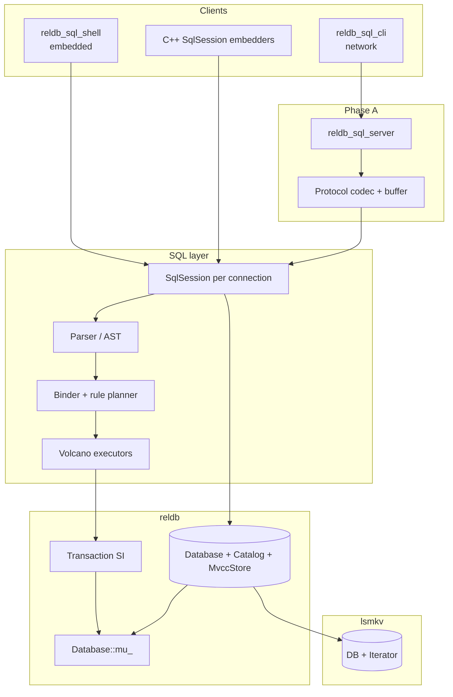
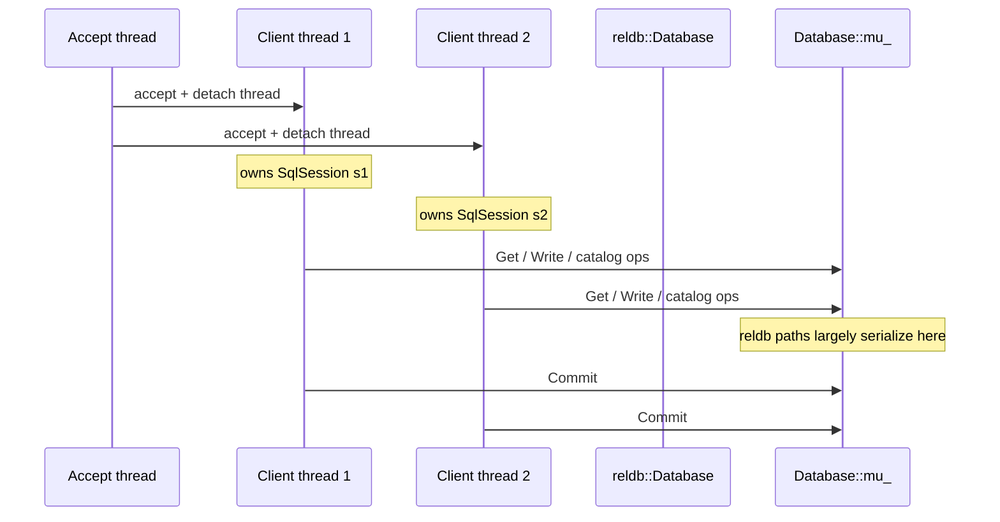
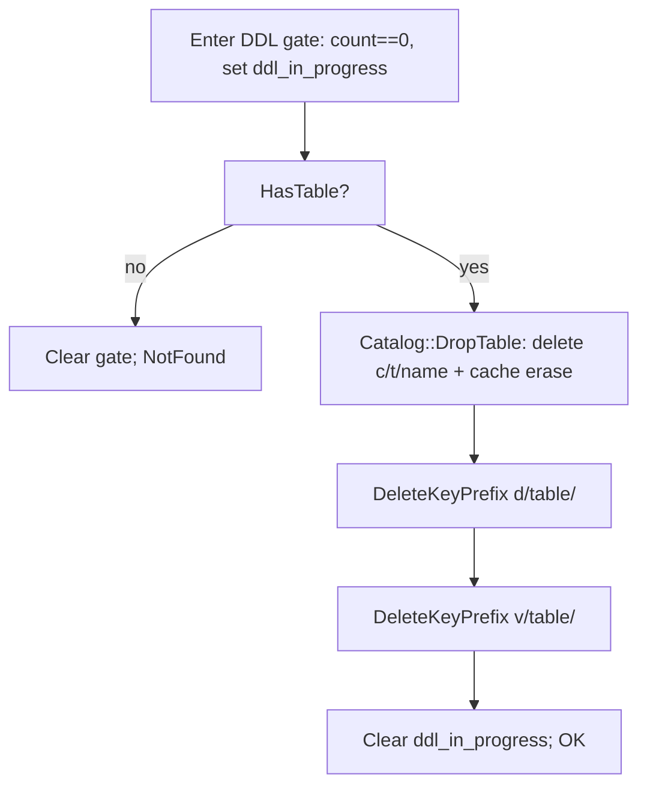

# Roadmap: SQL Server, DDL Extensions, Aggregates, and Joins

| Field | Value |
|-------|--------|
| **Document** | `docs/ROADMAP_SERVER_DDL_AGG_JOIN.md` |
| **Author** | _TBD_ |
| **Date** | 2026-07-12 |
| **Status** | Draft (revised after design re-review) |
| **Repo** | `randomtiwary/lsm-kv` |
| **Language** | C++17 |
| **Audience** | Senior engineers familiar with `reldb` / `SqlSession` / `lsmkv::Server` |

---

## Overview

Today `lsm-kv` is a layered educational stack: an LSM key-value engine (`lsmkv`), an
MVCC + snapshot-isolation relational core (`reldb`), and a single-table SQL frontend
(`SqlSession`: parse → bind → rule-based plan → volcano executors). Clients either link
the library or run the local interactive shell (`reldb_sql_shell`). A separate TCP
binary (`lsmkv_server` on port **7379**) speaks a line-oriented **raw KV** protocol
(`PING`/`GET`/`SET`/`DEL`) and is intentionally not SQL.

This document proposes an incremental, PR-sized roadmap to:

1. **Phase A** — Networked **SQL server** + thin CLI client (session-per-connection)
2. **Phase B** — **DDL extensions**: `DROP TABLE`, `ALTER TABLE ADD/DROP COLUMN`
3. **Phase C** — **Aggregates**: `COUNT`/`SUM`/`AVG`/`MIN`/`MAX`, `GROUP BY` (optional `HAVING`)
4. **Phase D** — **Joins**: `INNER JOIN … ON` via nested-loop (optional outer later)

Each phase keeps the embedded library and local shell working. Defaults favor clarity
over production features (no auth, no cost-based optimizer, non-transactional DDL).

---

## Background & Motivation

### Current state (what exists)

| Layer | Key types / entry points | Notes |
|-------|--------------------------|--------|
| **lsmkv** | `DB::Put/Get/Delete`, `DB::NewIterator` | WAL, MemTable, SSTables, compaction |
| **reldb** | `Database`, `Transaction`, `Catalog`, `MvccStore` | SI; see locking below |
| **SQL** | `SqlSession::Execute`, volcano `Executor`s | Single-table `SELECT`; no agg/join |
| **Shell** | `examples/reldb_sql_shell.cpp` | Multi-line until `;`; Readline history |
| **KV server** | `server/server.{h,cpp}`, port 7379 | One thread per client; `ExecuteRequest` testable without sockets |

**Key layout (relational):**

```
c/t/<table_name>           → TableSchema::Encode()     (catalog)
d/<table>/<pk_hex>         → version_id (row head)
v/<table>/<pk_hex>/<vid>   → VersionRecord (payload = Row::Encode())
m/next_ts, m/txn/<id>, …   → oracles / txn registry
```

**Schema / row constraints (v1):**

- Rows are ordered `Value` lists matching schema column order (`Row::ValidateAgainst`).
- **Null cells are not allowed** in typed columns today.
- Schema encode is binary without a version tag (`schema.cpp`: `PutLengthPrefixedSlice(name)` first).
- Catalog comment: *"v1 does not support DROP TABLE or ALTER"*
  (`include/reldb/catalog.h`).
- DDL (`CreateTable` / SQL `CREATE TABLE`) is **non-transactional** and rejected while
  `SqlSession::InTransaction()` (`sql_session.cpp` `RunCreateTable`).
- `Catalog` cache (`mutable unordered_map`) has **no mutex** today — unsafe under multi-client
  (addressed in Phase A; see K18).

**Actual `Database::mu_` scope (verified in code):**

| Path | Holds `mu_`? |
|------|----------------|
| `Database::Begin` / `CommitTransaction` / `AbortTransaction` | Yes |
| `Transaction::Write` (Insert/Update/Delete path) | Yes |
| `Transaction::Get` | Yes |
| `TableRowScan::Advance` (row resolve) | Yes (locks while resolving) |
| `Catalog::GetTable` / `CreateTable` | **No** (race under multi-client) |
| Underlying `lsmkv::DB::Get` / iterators | Engine rules; separate from reldb `mu_` |

`std::mutex` is **not recursive**. Holding `mu_` while calling `Begin`/`Commit`/`Get`/`Write`
deadlocks. Concurrent SI “readers” are largely **serialized at the reldb layer** today;
do not assume freely parallel Get/Scan throughput.

**SQL stack files:**

- Headers: `include/reldb/sql_session.h`, `sql_ast.h`, `sql_parser.h`, `executor.h`,
  `expr.h`, `query_result.h`
- Executors: `SeqScan`, `PkPointGet`, `PkRangeScan`, `Filter`, `Project`, `Sort`,
  `Limit`, `InsertOp` / `UpdateOp` / `DeleteOp`
- `SelectStmt` has a single `table_name`; no aggregate nodes; no join nodes

### Pain points

1. **No remote multi-client SQL** — demos and teaching require process-local embedding
   or a single shell; concurrent SI examples across processes are awkward.
2. **Schema is create-only** — catalog mutation, row rewrite, and GC of MVCC keys cannot
   be taught without DROP/ALTER.
3. **No aggregates or joins** — the volcano model and binder stop at single-table
   projection; teaching group-by and multi-table binding needs first-class operators.
4. **Catalog not multi-client safe** — Phase A cannot ship concurrent sessions without
   synchronizing catalog cache + Create.

---

## Goals & Non-Goals

### Goals (this roadmap)

- **Phase A:** Long-lived TCP SQL server; one `SqlSession` per connection; multi-statement
  framing; SELECT/DML/DDL/txn results over the wire; simple CLI client; protocol unit
  tests without sockets; **catalog thread-safety** for multi-client.
- **Phase B:** `DROP TABLE`, `ALTER TABLE ADD COLUMN`, `ALTER TABLE DROP COLUMN` with
  explicit schema compatibility and data GC/rewrite strategies; still non-transactional
  DDL; global DDL gate (`open_txn_count_` + `ddl_in_progress_`).
- **Phase C:** Aggregate functions + `GROUP BY` via a new volcano operator; correct
  interaction with WHERE / ORDER BY / LIMIT; scalar aggregates on empty input.
- **Phase D:** Multi-table `FROM` / `INNER JOIN … ON` with nested-loop join; qualified
  names / aliases; parse-order join tree (no cost model).

### Non-Goals (explicit)

| Non-goal | Rationale |
|----------|-----------|
| Authentication / TLS | Educational v1; bind localhost by default |
| Wire protocol compatibility with Postgres/MySQL | Prefer a simple text protocol |
| Transactional DDL / online schema change | Matches existing CREATE TABLE model |
| Secondary indexes, FK, views, CTEs, subqueries, windows | Out of scope for this roadmap |
| Cost-based optimizer / join reordering | Rule-based only; join order = parse order |
| Merging SQL into the existing KV server process | Separate binary; see Key Decisions |
| Full SQL NULL semantics / three-valued types in base tables | ALTER uses DEFAULT; Null only in **result** cells for aggregates (and outer-join stretch) |
| Serializable isolation | SI remains the model |
| New `lsmkv::Status` codes (e.g. FailedPrecondition) | Use existing codes only (K19) |

---

## Key Decisions

| # | Decision | Choice | Rationale |
|---|----------|--------|-----------|
| K1 | SQL vs KV server binary | **New `reldb_sql_server`** binary (and small `reldb_sql_server_lib`); keep `lsmkv_server` unchanged | Different protocol, different DB type (`reldb::Database` vs `lsmkv::DB`), different session state. |
| K2 | Wire protocol style | **Line-oriented text**, Redis-ish replies | Reuses patterns from `server/server.cpp`. Easy to teach and unit-test. |
| K3 | Statement framing | Client sends SQL until a **`;` terminator** outside string literals (same as shell); may span multiple TCP lines. Multi-statement buffer → one reply = **last** statement result (parity with `SqlSession::Execute`). | Matches shell and session API. |
| K4 | Session model | **One `SqlSession` per connection**, sharing one `std::shared_ptr<Database>` | Transaction stickiness requires session state. |
| K5 | Default bind address | **`127.0.0.1`** for SQL server | No auth; fail closed for remote exposure. |
| K6 | Default SQL port | **7380** (KV stays 7379) | Avoid colliding with `lsmkv_server`. |
| K7 | DDL transactionality | **Non-transactional; reject if session `InTransaction()`** | Same as CREATE; documented in `docs/SQL.md`. |
| K8 | DROP TABLE GC | **Eager scan-delete** of `d/<table>/` and `v/<table>/` prefixes + catalog key, only when **no open txns** and not during DDL | No live scans mid-delete; educational clarity. |
| K9 | ALTER ADD COLUMN | Require **literal DEFAULT**; eager rewrite of live head payloads. No nullable base columns in first cut | Null cells forbidden in `ValidateAgainst`. |
| K10 | ALTER DROP COLUMN | **Eager rewrite** of live head payloads; **forbid dropping PK** | Avoids logical masks vs `Row::Encode` width. |
| K11 | Schema on-disk format | **Versioned prefix `SCH\\x01`**. Decode: **magic-match → versioned; else try-legacy fully consumed; else Corruption** (never peek single `0x01`) | Legacy first byte is varint name length; `0x01` collides with name length 1. Magic-first matches Phase B algorithm. |
| K12 | Aggregates executor | **`HashAggregateExecutor`** | Simple; works without sort. |
| K13 | Aggregate types (v1) | **Int64** for SUM/AVG/MIN/MAX; COUNT always; AVG = truncating Int64 division | No float `ColumnType`. |
| K14 | HAVING | **Phase C.2** (follow-up PR after GROUP BY) | Filter on aggregate output. |
| K15 | Join algorithm (v1) | **Nested-loop join** only | Educational; no secondary indexes. |
| K16 | Join syntax (v1) | **`INNER JOIN t2 ON <bool expr>`** only; left-deep parse order | Explicit ON; no USING/NATURAL. |
| K17 | Local shell | **Keep embedded shell** | Network CLI is additive. |
| K18 | Catalog concurrency | **Catalog never locks.** Callers (`Database` DDL APIs, `Transaction` paths, session helpers) **must hold `Database::mu_`** before any Catalog call. Catalog documents precondition “caller holds `mu_`.” Create/Get/Drop/Put are atomic under that single lock. | Unsynchronized `cache_` is UB under multi-client. Nested `lock_guard` on non-recursive `mu_` deadlocks — Catalog must not re-lock. |
| K19 | Status codes for DDL gates | **`InvalidArgument`** with fixed messages (no new Status codes) | `lsmkv::Status` has only Ok/NotFound/Corruption/NotSupported/InvalidArgument/IOError/Conflict. Match existing `"DDL is not allowed inside a transaction"`. |
| K20 | Global DDL gate | **`open_txn_count_` + `ddl_in_progress_`** on `Database`. CREATE/DROP/ALTER require `open_txn_count_ == 0`, set `ddl_in_progress_` for the duration, run **entire body under `mu_`**. Concurrent `Begin` **blocks on `mu_`** until DDL finishes (typically succeeds after); `ddl_in_progress_` is belt-and-suspenders / future multi-section DDL. | Multi-client safe rewrite/GC; see state machine + concurrency note. |
| K21 | ALTER rewrite mechanism | **Collect-then-rewrite under `mu_`**: (1) collect all head PKs under `d/<table>/`; (2) destroy iterator; (3) for each PK install committed versions via `MvccStore::PutVersion` / `PutVersionValue` (`start_ts = commit_ts`, not provisional). Never call `Transaction::Begin/Commit/Write/Get` while holding `mu_`. Never Put/Delete while a head iterator is live. | Avoids non-recursive mutex deadlock and iterator invalidation (same class of bug as DROP). |
| K22 | Wire cell codec | **One typed form only:** `$N`; `$I:<decimal>`; `$B:0|1`; **string `$S:` + C-style escapes** on a single line (`\\`, `\n`, `\r`, `\t`, `\xNN`; empty = `$S:`). Not TSV, not raw length-prefixed multi-line bodies, not base64. | Distinguishes Null (`$N`) from string `"NULL"` (`$S:NULL`); line-oriented RecvLine stays simple. |
| K23 | Empty scalar aggregates | **COUNT → 0**; **SUM/AVG/MIN/MAX → Null result cell**; GROUP BY with no input → **zero rows** | Single policy; Null only in results. |
| K24 | Materializing executors | HashAggregate / NestedLoopJoin follow **`SortExecutor` pattern**: materialize in `Open()`, freeze `PlanTag`, **`child_.reset()`** to release scans | Avoids `TableRowScan` / iterator lock issues (`executor.h`). |
| K25 | SELECT AST evolution | Early **C0** PR extends `SelectStmt` with empty `group_by` / join fields so C and D do not thrash shapes | Reduces merge pain. |

---

## Proposed Design

### High-level architecture (after all phases)



### Thread model (Phase A)



- **Accept loop:** same pattern as `lsmkv::Server::Serve` — `select` with short timeout,
  `accept`, `TryReserveClientSlot`, detach `std::thread` per client.
- **Shared state:** one `std::shared_ptr<reldb::Database>` for the process.
- **Per connection:** `SqlSession` (holds optional open `Transaction`).
- **Concurrency reality:** most reldb read/write/commit paths take `Database::mu_`.
  Multi-client still teaches SI **semantics** (snapshots, WW conflicts) even when the
  educational engine serializes execution. Capacity is not “N parallel LSM readers
  through reldb.”
- **Catalog:** never locks; all access while holding `Database::mu_` (K18).
- **Scan lifetime:** destroy scan-bearing executors before Commit/writes on the same
  txn (`executor.h`).

**Rough capacity (educational, honest):**

| Metric | Target / note |
|--------|----------------|
| Max clients | 128 (connection slots; same default as KV server) |
| Concurrent open txns | Up to max clients (≤1 open txn per connection) |
| reldb-level parallelism | Low — `mu_` serializes Get/Write/Commit/DDL |
| Statement latency | Dominated by LSM I/O + reldb lock wait |
| Max statement buffer | **1 MiB**; on exceed → `-ERR InvalidArgument: statement too large` and **clear buffer** (connection stays open) |
| Max result rows | Unbounded in v1; document OOM risk |

---

## Phase A — SQL Server

### Recommendation: new binary, not KV extension

**Recommend `reldb_sql_server`** under `sql_server/`, with:

- `SqlServerConfig { host="127.0.0.1", port=7380, db_path, max_clients=128 }`
- Pure protocol helpers — **no sockets** — unit-testable like `lsmkv::ExecuteRequest`.
- `class SqlServer` — Start / Serve / Stop mirroring `lsmkv::Server`.

**Do not** bolt SQL onto `lsmkv_server`.

### Catalog thread-safety (required for multi-client Phase A)

**Problem:** `Catalog::GetTable` mutates `cache_` on miss; `CreateTable` is check-then-act
without a lock. Concurrent client threads → data race (UB).

**Locked design (K18) — single shape only:**

1. **`Catalog` never locks.** No `mutex` inside Catalog; no `lock_guard` on
   `Database::mu_` from Catalog methods. Catalog is a pure map + KV helper with
   documented precondition: **caller holds `Database::mu_`**.

2. **Every entry point that touches Catalog takes `mu_` first**, then calls Catalog:
   - `Database::CreateTable` / `DropTable` / `Alter*` / any `GetTable` helper
   - `Transaction::{Get, Write, Scan, …}` — today `Get` calls `catalog()->GetTable`
     **before** taking `mu_`; **PR A0.5 must reorder** so catalog lookup is under
     `mu_` (or go through a `Database` helper that locks).
   - `SqlSession::LookupTable` must use a Database helper under `mu_`, not bare
     `catalog()->GetTable` without the lock.

3. **Lock order (only one lock):**

   ```
   Database::mu_   // oracle, txn apply, row paths, AND all catalog access
   ```

4. **Rejected:** Catalog holding `mutex*` to `&Database::mu_` and
   `lock_guard(*mu_)` on every method — nested lock on non-recursive `std::mutex`
   deadlocks when Database already holds `mu_` (ALTER/DROP/CREATE under lock then
   `catalog_->GetTable`). See Alternatives.

5. Tests: multi-thread hammer concurrent lookups + `CreateTable` distinct names;
   same-name Create races resolve without crash/UB (TSAN if CI allows).

### Wire protocol (v1) — frozen

#### Framing rules

1. Client may send multi-line SQL. Server appends each received line (re-inserting `\n`
   between lines as needed) to a **per-connection statement buffer**.
2. Buffer is complete when it ends with a `;` **outside** single-quoted strings
   (same algorithm as `EndsWithStatementTerminator` in `reldb_sql_shell.cpp`).
3. On complete buffer: call `session.Execute(buffer, result)`; encode reply; clear buffer.
4. If buffer size would exceed **1 MiB**: do not append; reply
   `-ERR InvalidArgument: statement too large\n`; clear buffer; keep connection open.
5. Meta commands (single line, no `;` required):
   - `PING` → `+PONG\n`
   - `QUIT` → `+OK\n` then close
   - `RESET` → if open txn, Abort; clear buffer → `+OK\n`
   - `STATUS` → `+OK in_txn=0|1\n` (optional but cheap)

#### Reply encoding (normative)

Errors use **`Status::ToString()`** (already `"InvalidArgument: …"`, `"Conflict: …"`):

```
-ERR <Status::ToString()>\n
```

Examples:

```
-ERR InvalidArgument: DDL is not allowed inside a transaction
-ERR Conflict: write-write conflict
-ERR NotFound: table not found: users
```

| Outcome | Encoding |
|---------|----------|
| Simple OK (DDL, BEGIN, COMMIT, ABORT) | `+OK\n` |
| DML with rows_affected | `+OK rows_affected=<n>\n` |
| SELECT (incl. 0 rows) | Result block below |
| Error | `-ERR ` + `status.ToString()` + `\n` |

**SELECT result block (locked grammar):**

```
*PLAN <tag>\n          # only if plan_tag non-empty
*RESULT <nrows> <ncols>\n
*COLS <ncols>\n
<colname-0>\n
...
<colname-ncols-1>\n
*ROW\n
<cell-0>\n
...
<cell-ncols-1>\n
...                    # nrows row blocks
*END\n
```

Column names and cells are **one logical field per line** after their headers (no TSV).

**Cell codec (locked — K22) — exactly one form per type:**

| Value | Wire form (always one protocol line) |
|-------|--------------------------------------|
| Null | `$N` |
| Int64 | `$I:<decimal>` (e.g. `$I:-42`) |
| Bool | `$B:0` or `$B:1` |
| String | `$S:` + C-style escapes on the remainder of the line |

**String escape rules (locked):**

| In string | On wire after `$S:` |
|-----------|---------------------|
| backslash | `\\` (two chars on wire) |
| newline | `\n` |
| CR | `\r` |
| tab | `\t` |
| other bytes `< 0x20` or `0x7F` | `\xNN` (two hex digits; decode accepts A–F or a–f) |
| printable ASCII otherwise | as-is (including space; no quotes) |
| empty string | `$S:` with nothing after the colon |

Examples: `"ada"` → `$S:ada`; `"NULL"` → `$S:NULL`; `""` → `$S:`; string `a` + newline + `b` → `$S:a\nb`.

**Decode errors:** unknown escape (e.g. `$S:\q`), truncated `\xN`, or a cell line that does not start with `$N` / `$I:` / `$B:` / `$S:` → protocol/test decode error. Server-side encode never produces these.

This distinguishes Null (`$N`) from string `"NULL"` (`$S:NULL`).

**Rejected string encodings** (do not implement; see Alternatives): raw `$S:<nbytes>` multi-line body; `$S:<n>:` + base64/hex; TSV + `Value::ToString()`.

**DML / empty SELECT:** zero-row SELECT still sends `*RESULT 0 <ncols>`, column names, `*END`.

#### Multi-statement scripts

Allow multi-statement buffers; one reply = last statement’s result (matches shell).
Clients that need every result send one statement per buffer.

#### Transaction stickiness

```
Client                         Server SqlSession
------                         -----------------
BEGIN;                      →  +OK   (txn open)
INSERT …;                   →  +OK rows_affected=1
SELECT …;                   →  *RESULT … (sees insert)
COMMIT;                     →  +OK
```

Connection drop: destroy `SqlSession` → `Transaction` dtor Aborts if not finished.

### Client

**`reldb_sql_cli`:**

- Args: `--host 127.0.0.1 --port 7380`
- Interactive: lines until `;`, send, pretty-print typed cells
- Non-interactive: stdin / file
- Does **not** replace `reldb_sql_shell`

Shared protocol encode/decode lives in `sql_server/protocol.*` and is linked by
server tests, server binary, and CLI (single contract).

### File layout (Phase A)

```
sql_server/
  sql_server.h
  sql_server.cpp
  protocol.h / protocol.cpp   # framing + cell codec + QueryResult encode
  main.cpp                    # reldb_sql_server
examples/
  reldb_sql_cli.cpp
scripts/
  run_sql_server.sh
  run_sql_cli.sh
tests/
  test_sql_protocol.cpp       # no sockets
  test_sql_server.cpp         # optional localhost smoke
  test_reldb_catalog_mt.cpp   # catalog multi-thread (A0.5)
CMakeLists.txt
```

### Interface sketch

```cpp
namespace reldb {

struct SqlServerConfig {
    std::string host = "127.0.0.1";
    int port = 7380;                 // 0 = ephemeral (tests)
    std::string db_path = "./reldb_sql_data";
    int max_clients = 128;
};

// Encode QueryResult or Status into reply bytes (includes trailing newlines).
void EncodeOk(std::string* reply);
void EncodeOkRowsAffected(std::uint64_t n, std::string* reply);
void EncodeError(const lsmkv::Status& st, std::string* reply);  // "-ERR " + st.ToString()
void EncodeQueryResult(const QueryResult& result, std::string* reply);

// Append line (without '\n') to conn_buffer. If complete, Execute and fill reply.
// Returns false if connection should close (QUIT).
bool SqlHandleLine(SqlSession* session,
                   std::string* conn_buffer,
                   const std::string& line,
                   std::string* reply);

class SqlServer {
public:
    explicit SqlServer(SqlServerConfig config);
    lsmkv::Status Start();  // Database::Open + bind/listen
    void Serve();
    void Stop();
    int port() const;
};

}  // namespace reldb
```

### Observability (Phase A)

| Signal | Mechanism |
|--------|-----------|
| Startup | stderr: bind address, port, db_path |
| Accept failures / max clients | stderr (same as KV server) |
| Per-statement | Optional env log: duration + status code only (no SQL text by default) |
| Metrics | `active_clients` atomic |

### Security & privacy (Phase A)

- **No authentication.** Default bind `127.0.0.1`.
- **No TLS.** Document `--host 0.0.0.0` as lab-only.
- **Do not log full SQL** in default builds.

### Rollout (Phase A)

1. **A0.5** catalog mutex / `mu_` coverage + stress test (blocks multi-client soundness).
2. Protocol + unit tests (no listen).
3. `SqlHandleLine` + session tests.
4. `SqlServer` + binary + script.
5. Localhost integration test.
6. CLI.

**Rollback:** additive binaries only; no on-disk format change in Phase A.

---

## Phase B — DDL Extensions

### Grammar additions

```
drop_table   := DROP TABLE name
alter_table  := ALTER TABLE name alter_action
alter_action := ADD COLUMN alter_col_def DEFAULT literal
              | DROP COLUMN name

# ALTER ADD only — no PRIMARY KEY clause (CREATE keeps full col_def)
alter_col_def := name type
```

Session rules:

- Reject if `InTransaction()`:
  `InvalidArgument: DDL is not allowed inside a transaction`
- Also enforce **global gate** (K20) — see state machine below.
- Apply immediately via `Database` APIs (not user txn write set).

### Global DDL / txn state machine (locked — K20)

```
State fields on Database:
  open_txn_count_ : size_t   // in-memory only; always 0 after Open+RecoverTxns
  ddl_in_progress_ : bool
```

| Event | Precondition | Action | Error if violated |
|-------|--------------|--------|-------------------|
| `Begin` | `!ddl_in_progress_` | `open_txn_count_++` under `mu_` | `InvalidArgument: DDL in progress` |
| `CommitTransaction` success or Conflict after finish | count ≥ 1 | `open_txn_count_--` exactly once when txn becomes finished | — |
| `AbortTransaction` | count ≥ 1 | `open_txn_count_--` exactly once when txn becomes finished | — |
| `Transaction` dtor | if `!finished_` calls `Abort()` | Abort path decs once; dtor does not dec separately | Abort early-returns if already finished (existing code) |
| `TEST_AbandonWithoutAbort` | test only | Must **not** leave count elevated: either dec in abandon or forbid under production DDL tests | Document: production code never uses abandon |
| Autocommit SELECT/DML | same as Begin/Commit pair | Brief elevation of count → **blocks DDL** for statement duration | Intended; document |
| `RecoverTxns` on Open | — | Aborts durable Open txns; **count starts at 0** (no durable count) | — |
| `CreateTable` / `DropTable` / `Alter*` | `open_txn_count_ == 0` && `!ddl_in_progress_` && (SQL session not InTransaction) | set `ddl_in_progress_=true`, run, clear in RAII | `InvalidArgument: DDL requires no open transactions` |

**CREATE joins the same global gate** as DROP/ALTER (K20) so multi-client demos do not
race CREATE with concurrent Begin. Session-local `InTransaction()` check remains as a
clearer error for the common “BEGIN; CREATE” mistake.

**`ddl_in_progress_` vs `mu_` (locked educational policy):**

DDL runs the **entire** rewrite/GC body while holding `mu_`. Concurrent `Begin` (and
other `mu_` takers) **block on the mutex** until DDL unlocks, then proceed. After DDL
clears `ddl_in_progress_` before unlock, a waiting `Begin` typically **succeeds** — it
does **not** usually observe the mid-DDL flag. The flag is still required for:

- clear documentation of exclusive DDL intent;
- future multi-section DDL that might release `mu_` between phases;
- tests that set the flag without holding a long critical section.

Do **not** structure v1 DDL as “set flag, unlock, rewrite, re-lock” — keep the simple
hold-`mu_`-for-whole-DDL model. Document that the common concurrent-Begin behavior is
**wait**, not `InvalidArgument: DDL in progress`.

**Inc/dec discipline:**

- Increment only in `Database::Begin` when returning a live txn.
- Decrement only in `CommitTransaction` / `AbortTransaction` when transitioning
  `finished_ false → true` (single place that sets finished).
- Conflict on commit: txn is finished → still exactly one dec (same as success path).

### Catalog API extensions

```cpp
// catalog.h
lsmkv::Status DropTable(const std::string& name);      // delete key + erase cache
lsmkv::Status PutTable(const TableSchema& schema);     // overwrite encode + cache

// database.h
lsmkv::Status DropTable(const std::string& name);
lsmkv::Status AlterTableAddColumn(const std::string& table, const ColumnDef& col,
                                  const Value& default_value);
lsmkv::Status AlterTableDropColumn(const std::string& table,
                                   const std::string& col_name);
```

All catalog mutations/lookups **while caller holds** `mu_` (K18); Catalog itself never locks.

### Schema encode versioning (locked — K11)

**Legacy layout** (what exists today in `schema.cpp`):

```
varint32 name_len | name bytes
varint32 num_columns
repeated: varint32 col_name_len | col_name | u8 type | u8 primary_key
```

**Versioned layout (new writes):**

```
u8 'S' | u8 'C' | u8 'H' | u8 0x01     # magic + format version
varint32 name_len | name bytes
varint32 num_columns
repeated:
  varint32 col_name_len | col_name
  u8 type
  u8 primary_key
  u8 flags                              # bit0 reserved nullable=0
```

**Decode algorithm (byte-for-byte policy):**

```
Status TableSchema::Decode(bytes, out):
  1. If bytes size >= 4 and bytes[0..3] == 'S','C','H',0x01:
       parse versioned body from offset 4; require empty trailing; return.
  2. Else try LegacyParse(bytes):
       if OK and fully consumed → return legacy schema.
  3. Else return Corruption.

Encode() always writes versioned layout after B1 lands.
```

**Why not magic `0x01` alone:** legacy `PutLengthPrefixedSlice(name)` starts with a
varint length; table name length **1** encodes as first byte `0x01` — collision.

**Golden tests required:** legacy name len 1 (`t`), len 127, typical multi-byte names;
round-trip versioned; reject truncated versioned; legacy file still opens after upgrade
read path.

**Alternatives rejected:** separate `c/meta/<name>` key (extra Get); single-byte high-bit
only without try-both (still ambiguous for some varints) — multi-byte `SCH\\x01` +
**magic-first, else legacy** is clearer (not “try-legacy first”).

### DROP TABLE — concrete algorithm

**Guarantees (v1, locked):**

1. If `open_txn_count_ > 0` or `ddl_in_progress_` → fail
   `InvalidArgument: DDL requires no open transactions` (or `DDL in progress`).
2. No concurrent user scans or writers for this DB while DDL runs (`ddl_in_progress_`
   blocks `Begin`; count 0 means no open txns).
3. After successful DROP: `GetTable` → NotFound; prefix scans of `d/<table>/` and
   `v/<table>/` empty (best-effort if crash mid-GC — see risks).



**Prefix delete:**

```cpp
// Seek(prefix); while Valid && key starts_with(prefix):
//   copy key; Delete(key); re-seek or Next carefully.
Status DeleteKeyPrefix(lsmkv::DB* db, const std::string& prefix);
```

**Iterator + Delete:** do **not** assume an open iterator remains valid across
`Delete`. Pattern: collect keys in a batch (or delete current key then
`Seek(prefix)` / `Seek(next)` again). For educational tables, collecting all keys
under prefix then deleting is simplest and avoids iterator invalidation.

**Crash mid-GC:** catalog gone, orphan `d/`/`v/` keys possible — table name does not
resurrect; space leak until optional vacuum (out of scope).

### ALTER TABLE ADD COLUMN — locked rewrite algorithm (K21)

#### Policy

| Rule | Value |
|------|--------|
| DEFAULT clause | **Required** literal |
| Default type | Must match new column type; non-Null |
| PRIMARY KEY on new column | **Forbidden** (grammar + validate) |
| Position | Append as **last** column |
| Open txns | Must be 0; `ddl_in_progress_` set |

#### Algorithm (pseudocode against real APIs) — **collect then rewrite**

Same iterator rule as DROP: **do not** `PutVersion` / `SetHead` / `Delete` while a
live iterator is scanning `d/<table>/` (`PutVersion` mutates the head under that
prefix). Collect first; destroy iterator; then mutate.

```
Status Database::AlterTableAddColumn(table, col, default_value):
  lock_guard lock(mu_);   // entire DDL body under mu_ (callers block on mu_)

  if (open_txn_count_ != 0) return InvalidArgument("DDL requires no open transactions");
  if (ddl_in_progress_) return InvalidArgument("DDL in progress");
  ddl_in_progress_ = true;
  // RAII clear ddl_in_progress_ on exit (still under lock)

  TableSchema old;
  RELDB_RETURN_NOT_OK(catalog_->GetTable(table, &old));  // precondition: mu_ held; Catalog does not lock
  // validate: no duplicate name; col not PK; default type matches; !default.IsNull()

  TableSchema neu = old columns + col;

  // Phase 1: collect head keys / PKs (read-only iteration)
  vector<Value> pks;
  {
    auto it = kv_->NewIterator(ReadOptions());
    string prefix = "d/" + table + "/";
    it->Seek(prefix);
    while (it->Valid() && it->key().starts_with(prefix)):
      pks.push_back(DecodePkFromKey(suffix));
      it->Next();
    // destroy it here — end of scope
  }

  // Phase 2: rewrite each PK with no live head iterator
  for (pk in pks):
    // Load head version id; GetVersion; find live committed version
    // (start_ts != 0, end_ts == 0, !tombstone). Skip pure tombstone heads.
    Row row; Decode(payload);
    if row.size() == neu.num_columns(): already migrated; continue
    if row.size() != old.num_columns(): return Corruption
    row.push_back(default_value);
    ValidateAgainst(neu);

    commit_ts = next_ts_++;
    prior.end_ts = commit_ts;
    PutVersionValue(table, pk, prior);   // close prior live version

    VersionRecord neu_rec;
    neu_rec.version_id = next_version_id_++;
    neu_rec.start_ts = commit_ts;
    neu_rec.end_ts = 0;
    neu_rec.prev_id = prior.version_id;
    neu_rec.created_by = 0;              // DDL system install (document)
    neu_rec.is_tombstone = false;
    neu_rec.payload = row.Encode();
    PutVersion(table, pk, neu_rec);      // version key + SetHead

  PersistOracles if needed (next_ts_ / next_version_id_)
  RELDB_RETURN_NOT_OK(catalog_->PutTable(neu));
  return OK;
```

**Explicit forbids:**

- Do **not** call `Begin` / `Commit` / `Transaction::Write` / `Get` while holding `mu_`.
- Do **not** install provisional versions (`start_ts == 0`) for DDL rewrites.
- Do **not** mutate heads/versions while a prefix iterator on `d/<table>/` is live
  (collect-then-rewrite only).

**Historical versions:** older chain entries keep **old width** payloads. Visibility for
snapshots with `start_ts` before the DDL commit_ts may see pre-ALTER widths. **v1
teaching simplification:** with `open_txn_count_ == 0`, no user snapshot older than
“now” is active in-process. After ALTER, **new** transactions use `start_ts ≥ commit_ts`
and only need head payloads at new width. Document that **crash recovery of very old
snapshots across ALTER is unsupported** (no open txns at ALTER time; historical chain
is for MVCC correctness of pre-existing committed history within a process epoch).

If a post-ALTER reader walks an old version with wrong width: only happens for
snapshots `< commit_ts`. With no open txns at ALTER, only new txns exist → they use
heads. Safe for v1.

**DROP COLUMN:** same skeleton; remove cell at index; forbid PK index.

### Concurrent readers during DDL

| Scenario | Behavior |
|----------|----------|
| Any open user txn | DDL fails (count > 0) |
| Autocommit in flight | Holds count ≥ 1 → DDL waits/fails when it checks |
| Concurrent `Begin` during DDL | **Blocks on `mu_`** until DDL unlocks; then usually succeeds (flag already cleared). Mid-DDL `InvalidArgument: DDL in progress` is rare under v1 hold-mu_-for-whole-DDL |
| `ddl_in_progress_` | Belt-and-suspenders exclusive intent; used if flag checked without waiting out a full rewrite |
| After DROP success | New statements: table NotFound |
| Mid-DROP crash | Orphans possible; catalog missing |

### SQL / AST / session touch points

- `sql_ast.h`: `DropTableStmt`, `AlterTableAddColumnStmt`, `AlterTableDropColumnStmt`
- `sql_parser.cpp`: DROP/ALTER (`alter_col_def` without PRIMARY KEY)
- `sql_session.cpp`: Run* with session + Database gates
- Tests: gate unit tests; DROP with data; ADD then SELECT; DROP COLUMN PK fails

### Data model migration summary

| Change | Disk impact |
|--------|-------------|
| Schema `SCH\\x01` | New catalogs; dual-read legacy |
| DROP | Deletes `c/t/*`, `d/t/*`, `v/t/*` |
| ADD/DROP COLUMN | New committed head versions; schema update |

---

## Phase C — Aggregates

### Dialect

```
select_list  := select_item (',' select_item)* | '*'
select_item  := agg_func '(' ( '*' | column_ref ) ')' [ AS name ]
              | expr [ AS name ]
agg_func     := COUNT | SUM | AVG | MIN | MAX

select_stmt  := SELECT select_list FROM from_clause
                [ WHERE expr ]
                [ GROUP BY column_ref (',' column_ref)* ]
                [ HAVING expr ]          -- C.2
                [ ORDER BY ... ]
                [ LIMIT ... ]
```

### Binder policy table (locked)

| Topic | Policy |
|-------|--------|
| Agg arguments v1 | `COUNT(*)` or **single column ref** only — **no** `SUM(a+b)` |
| Non-agg in select with aggs | Must be GROUP BY columns exactly |
| `SELECT *` + aggregates | **Reject** |
| GROUP BY column in select list | **Not required** (output = select list only) |
| Agg output name | `AS` alias if present; else default `COUNT(*)` / `SUM(col)` / … stable `ToString` form |
| ORDER BY | Binds to **output** column names only (after select list naming) |
| HAVING (C.2) | Binds to output names + group cols + agg default names; no input-table-only cols |
| Scalar agg (no GROUP BY) | One output row |
| Empty input scalar COUNT | One row, `0` |
| Empty input scalar SUM/AVG/MIN/MAX | One row, **Null** cell (`$N` on wire) |
| Empty input + GROUP BY | **Zero** output rows |

### AST sketch (C0 early)

```cpp
enum class AggFunc { kCount, kSum, kAvg, kMin, kMax };

struct SelectItem {
    enum class Kind { kExpr, kAgg } kind = Kind::kExpr;
    std::unique_ptr<Expr> expr;      // kExpr
    AggFunc agg_func = AggFunc::kCount;
    bool agg_star = false;
    std::string agg_column;          // if !agg_star
    std::string output_name;         // required after bind
};

// SelectStmt (evolving):
//   std::vector<SelectItem> select_items; // or keep select_star + lists
//   std::vector<std::string> group_by;
//   std::unique_ptr<Expr> having;
//   FromClause from;  // C0/D0: table + empty joins first
```

### Physical plan

```
access path → Filter(WHERE) → HashAggregate → [Filter(HAVING)] → Sort → Limit
```

### `HashAggregateExecutor` (K24)

```cpp
// Open():
//   plan_tag_ = "HashAggregate<-" + child_->PlanTag();
//   drain child into hash map;
//   child_.reset();  // same as SortExecutor
// Next(): emit from map
```

**Types:** COUNT → Int64; SUM/AVG/MIN/MAX Int64 in/out; AVG trunc toward 0;
overflow → `InvalidArgument` via checked add.

**Empty input:** see binder policy / K23.

### HAVING (C.2)

`FilterExecutor` over aggregate output; bind against output schema.

---

## Phase D — Joins

### Dialect (first cut)

```
from_item    := name [ AS alias ]
join_tail    := INNER JOIN from_item ON expr
from_clause  := from_item (join_tail)*
```

INNER only in D.1; LEFT OUTER stretch D.5.

### Name binding

```cpp
struct BoundTable {
    std::string table_name;
    std::string alias;
    TableSchema schema;
    int row_offset;
};
// Unqualified → unique or ambiguous error
// Qualified alias.col / table.col
// SELECT * → all columns left-to-right as "alias.col"
```

### Nested-loop join (K24)

```cpp
// Open():
//   plan_tag_ = "NestedLoopJoin<-" + left + "," + right tags;
//   materialize right rows; right.reset();
//   open left; keep left OR materialize left too (v1: materialize both for simplicity)
// Prefer v1: materialize BOTH sides in Open(), reset both children, then nested loops
// pure in-memory — no live TableRowScan during Next().
```

**Join order:** parse order, left-deep. No cost model.
**Hash join:** later optional PR.

### Planner

```
NestedLoopJoin(access(t1), access(t2), on)
→ Filter(WHERE residual) → … → Sort → Limit
```

Predicate pushdown: optional nice-to-have; not required for D.1.

---

## API / Interface Changes (summary)

| Area | Before | After |
|------|--------|-------|
| Network | KV-only `lsmkv_server` | + `reldb_sql_server` + `reldb_sql_cli` |
| Catalog | Create/Get/Has unlocked | + Drop/Put; **Catalog never locks**; callers hold `mu_` |
| Database | `CreateTable`, txn oracles | + Drop/Alter; `open_txn_count_`; `ddl_in_progress_` |
| Status codes | existing set | **unchanged** (no FailedPrecondition) |
| SQL AST | single-table SELECT | + DROP/ALTER; SelectItem aggs; FromClause joins |
| Executors | … Sort … | + HashAggregate, NestedLoopJoin (Sort-like lifetime) |
| Schema codec | unversioned | `SCH\\x01` + legacy dual-read |
| Wire cells | n/a | typed `$N`/`$I`/`$B`/`$S` |

---

## Data Model Changes

| Phase | Change | Migration |
|-------|--------|-----------|
| A | Catalog locking only | — |
| B | Schema `SCH\\x01`; DROP prefixes; ALTER head rewrites | Dual-read legacy schemas |
| C–D | None on disk | — |

---

## Alternatives Considered

### 1) Extend `lsmkv_server` with SQL commands

| Pros | Cons |
|------|------|
| One port/process | Mixes layers; session vs stateless lines |

**Rejected** (K1).

### 2) Postgres wire protocol

**Rejected** — complexity vs educational ROI (K2).

### 3) Lazy DROP (catalog tombstone)

**Rejected** — eager prefix delete (K8).

### 4) Logical column masks for ALTER DROP

**Rejected** — eager rewrite (K10).

### 5) Nullable columns instead of DEFAULT for ADD

**Deferred** — DEFAULT + rewrite first (K9).

### 6) Sort-aggregate instead of hash

**Hash first** (K12).

### 7) Hash join first

**Nested loop first** (K15).

### 8) gRPC / protobuf API

**Rejected** — deps and mismatch with line protocol style.

### 9) Schema versioning via single-byte magic `0x01` peek

| Pros | Cons |
|------|------|
| Tiny header | **Collides** with legacy varint name length 1 |

**Rejected** — use `SCH\\x01` + magic-first dual-read (K11).

### 10) Schema version in separate key `c/meta/<name>`

| Pros | Cons |
|------|------|
| No encode ambiguity | Extra Get; two keys to keep in sync on CREATE/DROP |

**Rejected** for v1 — inline magic is enough with try-both decode.

### 11) Stop-the-world single-threaded server (no catalog lock)

| Pros | Cons |
|------|------|
| No catalog races | Gives up multi-client SI demos — main Phase A teaching goal |

**Rejected** — Catalog never locks; callers hold `Database::mu_` (K18).

### 11b) Catalog re-locks `Database::mu_` via `mutex*` on every method

| Pros | Cons |
|------|------|
| Catalog “self-protecting” | Nested `lock_guard` on non-recursive `std::mutex` **deadlocks** when Database already holds `mu_` (DDL/txn paths) |

**Rejected** — Catalog never locks (K18).

### 12) ALTER rewrite via normal user Transaction while holding `mu_`

| Pros | Cons |
|------|------|
| Reuse DML path | **Deadlocks** — `Begin`/`Write` take non-recursive `mu_` |

**Rejected** — committed `MvccStore` installs under `mu_` (K21).

### 13) TSV + `Value::ToString()` result cells

| Pros | Cons |
|------|------|
| Easy to eyeball | Null vs string `"NULL"` collision (`types.cpp` prints Null as `"NULL"`) |

**Rejected** — typed cell codec (K22).

### 13b) Raw length-prefixed string bodies (`$S:<n>` + multi-line raw) or base64

| Pros | Cons |
|------|------|
| Binary-safe without escapes | Breaks pure line-oriented `RecvLine` framing; two competing A1 implementations |

**Rejected** — single-line `$S:` + C-style escapes only (K22).

---

## Security & Privacy Considerations

| Topic | Approach |
|-------|----------|
| AuthN/AuthZ | Non-goal |
| Network | Default `127.0.0.1` |
| Injection | Not a web app; intentional SQL from clients |
| Logging | No full SQL by default |

---

## Observability

| Phase | Logging | Notes |
|-------|---------|-------|
| A | stderr start/stop; active_clients | plan_tag on wire when set |
| B | Log DDL action + table name | gate failures visible as InvalidArgument |
| C–D | plan_tag includes HashAggregate / NestedLoopJoin | |

---

## Rollout Plan

Phases are sequential on integration branch `feature/sql-server-ddl-agg-join`.
No runtime feature flags.

| Phase | Rollback |
|-------|----------|
| A | Stop shipping SQL server binary |
| B | Dual-read keeps old DBs open; cannot un-drop |
| C–D | Parser/feature revert; no disk change |

---

## Risks

| ID | Risk | Severity | Mitigation |
|----|------|----------|------------|
| R-A0 | Catalog data race under multi-client | **High** | PR A0.5; callers hold `mu_` before Catalog (Catalog never locks); stress test |
| R-A1 | Multi-line TCP buffering bugs | Med | Shared terminator tests with shell |
| R-A2 | Detached threads + Stop races | Med | Mirror KV server wait-for-clients |
| R-A3 | Huge SELECT memory | Med | Document; future cap |
| R-B1 | Crash mid-DROP orphans | Low | Document |
| R-B2 | ALTER rewrite deadlock / wrong width / skipped rows | **High** | K21 collect-then-rewrite; no txn under `mu_`; no Put under live head iterator; gate count==0 |
| R-B3 | Schema dual-read bugs | Med | Golden tests name len 1/127; SCH magic |
| R-B4 | Eager rewrite cost | Low | Educational scale |
| R-B5 | open_txn_count_ skew (double-dec / leak) | Med | Single dec site; dtor/Conflict tests |
| R-C1 | Int64 SUM overflow | Med | Checked arithmetic |
| R-C2 | AVG truncation | Low | Document |
| R-C3 | HashAggregate memory | Med | Same as Sort |
| R-D1 | Nested loop O(N×M) | Low–Med | Document |
| R-D2 | Column ambiguity | Med | Strict binder |
| R-D3 | Scan lifetime with joins/aggs | Med | K24 SortExecutor pattern |

---

## Open Questions

Only true product forks remaining:

1. **LEFT OUTER JOIN** in this roadmap vs stop at INNER?  
   **Default:** INNER only; OUTER is stretch PR D.5.
2. **Should `reldb_sql_cli` gain Readline?** Nice-to-have; not blocking.

Resolved into Key Decisions (no longer open): empty aggregate Null policy (K23),
global DDL gate (K20), CREATE under same gate (K20), wire cell codec (K22),
ALTER install path (K21), catalog locking (K18), Status codes (K19).

---

## References

- [docs/SQL.md](SQL.md) — SQL dialect, session, non-transactional DDL
- [docs/RELATIONAL.md](RELATIONAL.md) — MVCC layout, SI, catalog keys
- [docs/DESIGN.md](DESIGN.md) — LSM engine design
- `include/reldb/sql_session.h`, `sql_ast.h`, `sql_parser.h`, `executor.h`
- `include/reldb/catalog.h`, `schema.h`, `row.h`, `database.h`, `txn.h`, `mvcc.h`
- `include/lsmkv/status.h` — available Status codes
- `src/reldb/schema.cpp` — legacy encode; first byte = varint name length
- `src/reldb/types.cpp` — `Value::ToString()` Null → `"NULL"`
- `src/reldb/executor.cpp` — `SortExecutor` materialize + `child_.reset()`
- `server/server.h`, `server/server.cpp` — KV TCP pattern
- `examples/reldb_sql_shell.cpp` — `;` framing

---

## PR Plan

Ordered, small, reviewable PRs. Integration branch:
`feature/sql-server-ddl-agg-join`.

### Phase A — SQL server

| PR | Title | Files (primary) | Depends | Description |
|----|--------|-----------------|---------|-------------|
| **A0** | Design doc | `docs/ROADMAP_SERVER_DDL_AGG_JOIN.md`, pointer from README/SQL.md | — | This document. |
| **A0.5** | Catalog thread-safety | `catalog.*` (doc precondition only; **no Catalog mutex**), `database.*`, `txn.cpp` / session catalog call sites, `tests/test_reldb_catalog_mt.cpp` | A0 | Callers hold `mu_` then call Catalog; fix GetTable-before-lock; multi-thread stress. **Required before A4 multi-client.** |
| **A1** | Protocol codec frozen | `sql_server/protocol.*`, `tests/test_sql_protocol.cpp` | A0 | Framing; cells `$N`/`$I`/`$B`/`$S:`+escapes only; bad-escape decode tests; `EncodeError` = `-ERR `+`ToString()`; 1 MiB buffer; fixtures shared by CLI/server. |
| **A2** | `SqlHandleLine` + session tests | `sql_server/sql_server.*`, tests | A1, A0.5 | PING/QUIT/RESET; SQL execute; txn stickiness. |
| **A3** | TCP `SqlServer` + binary | `main.cpp`, CMake, `scripts/run_sql_server.sh` | A2 | Default 127.0.0.1:7380. |
| **A4** | Localhost multi-client test | `tests/test_sql_server.cpp` | A3, A0.5 | Ephemeral port; two clients; WW conflict; concurrent SELECT + CREATE. |
| **A5** | `reldb_sql_cli` | `examples/reldb_sql_cli.cpp`, scripts, README | A1, A3 | Uses same `protocol.*`. |

### Phase B — DDL

| PR | Title | Files (primary) | Depends | Description |
|----|--------|-----------------|---------|-------------|
| **B1** | Schema `SCH\\x01` dual-read | `schema.cpp/.h`, golden tests | A0 | **Magic-first** then legacy fully consumed; name len 1/127. |
| **B2** | `open_txn_count_` + `ddl_in_progress_` | `database.*`, `txn.*`, unit tests | A0.5 | State machine K20; Begin/Commit/Abort/Conflict/dtor tests. |
| **B3** | Catalog Drop + PutTable | `catalog.*`, tests | B1, A0.5 | Catalog APIs still lock-free; Database callers hold `mu_`. |
| **B4** | Prefix delete + `Database::DropTable` | database/mvcc helpers, tests | **B2**, B3 | Gate count==0; collect-then-delete keys; no iterator-across-Delete. |
| **B5** | SQL `DROP TABLE` | ast, parser, session, e2e | B4 | Session + global gates. |
| **B6** | ALTER ADD rewrite (**hardest**) | `database.cpp`, MvccStore installs, tests | B2, B3 | K21 **collect-then-rewrite** under mu_; no Put under live head iterator; committed versions only; oracle persist; N-row tests; effort: large. |
| **B7** | ALTER DROP COLUMN rewrite | database, tests | B6 | Forbid PK; rewrite heads. |
| **B8** | SQL `ALTER TABLE` | parser, session, e2e | B6, B7 | DEFAULT required grammar. |
| **B2b** | CREATE uses global DDL gate | `database.cpp` CreateTable, session tests | B2 | Align CREATE with K20 (can fold into B2). |

### Phase C — Aggregates

| PR | Title | Files (primary) | Depends | Description |
|----|--------|-----------------|---------|-------------|
| **C0** | `SelectStmt` shape prep | `sql_ast.h`, minimal compile fixes | A0 | Empty `group_by`, `SelectItem` stub, `FromClause` with single table — reduces D thrash. |
| **C1** | Parser for aggregates & GROUP BY | parser, tests | C0 | No execution. |
| **C2** | `HashAggregateExecutor` | executor, hand-built plans | C1 | K24 lifetime; empty input K23; overflow. |
| **C3** | Binder + planner e2e | sql_session, tests | C2 | Binder policy table. |
| **C4** | HAVING optional | parser, Filter on agg | C3 | C.2. |

### Phase D — Joins

| PR | Title | Files (primary) | Depends | Description |
|----|--------|-----------------|---------|-------------|
| **D1** | Parser INNER JOIN | parser, ast | C0 (prefer after C3) | Multi-table FROM. |
| **D2** | BindContext | bind helpers | D1 | Ambiguity; alias.col. |
| **D3** | `NestedLoopJoinExecutor` | executor, tests | D2 | Materialize both sides; K24. |
| **D4** | Planner e2e joins | sql_session, tests | D3, C3 | Left-deep; WHERE; ORDER BY; LIMIT. |
| **D5** | Stretch LEFT OUTER | parser, null-pad | D4 | Optional. |

### Dependency graph

```text
A0 ─┬─► A0.5 ─┬─► A2 ► A3 ► A4
    │         │           └► A5
    │         └─► (catalog safe for B*)
    ├─► A1 ───────────────┘
    │
    ├─► B1 ► B3 ─┐
    ├─► B2 ► B2b ┼► B4 ► B5
    │            └► B6 ► B7 ► B8
    │
    └─► C0 ► C1 ► C2 ► C3 ► C4
              └──────────► D1 ► D2 ► D3 ► D4 ► D5?
```

Default merge order for teaching demos: **A complete → B → C → D**.
B ∥ C allowed after A0.5 + A0; D should follow C3 binder maturity (C0 reduces AST pain).

### Testing matrix (cross-cutting)

| Area | Must cover |
|------|------------|
| Protocol | Partial lines; `;` in strings; multi-statement last-result; QUIT; 1 MiB overflow; Null cell `$N` vs `$S:NULL` |
| Catalog MT | Concurrent GetTable + CreateTable |
| Concurrency | Two clients SI; WW conflict |
| DDL gate | Begin×N; Conflict commit; dtor abort; DDL during autocommit fails; concurrent Begin during long DDL **waits on mu_** (does not require observing DDL-in-progress error) |
| DROP | Open txn → error; then SELECT NotFound; prefixes empty |
| ALTER | ADD+SELECT; DROP COLUMN PK fails; rewrite under mu_ without deadlock; **collect-then-rewrite** (N rows; no live iterator across Put) |
| Agg | Empty COUNT/SUM; GROUP BY; ORDER BY alias; type errors |
| Join | Match/no match; three-table; ambiguous column |
| Exec lifetime | After HashAggregate/NLJ Open, no live TableRowScan |

### Documentation

- Update `docs/SQL.md` per phase; README tools table (port 7380).
- Roadmap Status → Active as phases land.

---

## Appendix A — Protocol examples

### Happy path

```text
C: PING
S: +PONG

C: CREATE TABLE users(id INT PRIMARY KEY, name TEXT);
S: +OK

C: BEGIN;
S: +OK

C: INSERT INTO users(id, name) VALUES (1, 'ada');
S: +OK rows_affected=1

C: SELECT id, name FROM users WHERE id = 1;
S: *RESULT 1 2
S: *COLS 2
S: id
S: name
S: *ROW
S: $I:1
S: $S:ada
S: *END

C: COMMIT;
S: +OK

C: QUIT
S: +OK
```

### Multi-line statement buffer

```text
C: SELECT id, name
C: FROM users
C: WHERE id = 1;
S: *RESULT 1 2
S: *COLS 2
S: id
S: name
S: *ROW
S: $I:1
S: $S:ada
S: *END
```

### Error examples

```text
C: BEGIN;
S: +OK
C: CREATE TABLE t(id INT PRIMARY KEY);
S: -ERR InvalidArgument: DDL is not allowed inside a transaction

C: SELECT * FROM missing;
S: -ERR NotFound: table not found: missing
```

### Null result cell (empty SUM)

```text
C: SELECT SUM(n) FROM empty_table;
S: *RESULT 1 1
S: *COLS 1
S: SUM(n)
S: *ROW
S: $N
S: *END
```

### String cell vs Null; escapes

```text
# name = "NULL" (four letters) — not a null cell
S: $S:NULL

# name contains newline between a and b
S: $S:a\nb

# empty string
S: $S:
```

### Bad cell (CLI/test decode)

```text
# unknown escape — protocol/test harness reports decode error
S: $S:\q
```

---

## Appendix B — Example plans

```text
SELECT COUNT(*), SUM(n) FROM t WHERE n > 0;
→ HashAggregate<-Filter<-SeqScan

SELECT dept, COUNT(*) FROM emp GROUP BY dept ORDER BY dept;
→ Sort<-HashAggregate<-SeqScan

SELECT u.name, o.id FROM users u INNER JOIN orders o ON u.id = o.uid;
→ NestedLoopJoin(SeqScan, SeqScan)
```

---

## Appendix C — Estimated effort (rough)

| Phase | PRs | Effort notes |
|-------|-----|----------------|
| A | A0, A0.5, A1–A5 | Catalog lock + protocol are the real work; TCP is copy-paste of KV server |
| B | B1–B8 | **B6 ALTER rewrite is the hardest PR in the roadmap** (MVCC install, oracles, gates) |
| C | C0–C4 | Medium — binder rules + HashAggregate |
| D | D1–D5 | Medium — binding hardest; NLJ simple if both sides materialized |

Totals assume educational quality bar and tests at each PR.
